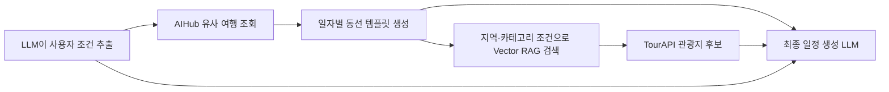

# AIHub 여행 동선 템플릿 조회

## 1. 목적

이 모듈은 사용자의 여행 조건과 비슷한 AIHub 여행자를 찾고, 해당 여행자의 과거 동선을 일정 생성에 사용할 수 있는 추상화된 템플릿으로 반환한다.

AIHub 장소를 최종 일정에 직접 사용하는 기능은 아니다. AIHub 데이터에서는 다음 정보만 참고한다.

- 일자별 이동 순서
- 하루 방문 슬롯 수와 슬롯 종류
- 방문지 체류시간
- 일자별 동선 중심 좌표와 검색 반경
- 과거 여행의 평균 만족도

최종 장소는 TourAPI 기반 Vector RAG에서 검색한다. AIHub와 TourAPI 장소 간 매핑은 사용하지 않는다.



## 2. 주요 파일

| 파일 | 역할 |
| --- | --- |
| `src/aihub/similarity.py` | 입력 조건, 유사도 계산, MySQL 조회, LLM용 동선 템플릿 생성 |
| `tests/aihub/test_aihub_similarity.py` | Mock 기반 로직·SQL 테스트 및 30가지 사용자 유형 테스트 |
| `tests/aihub/test_aihub_similarity_integration.py` | 실제 MySQL 데이터 조회 통합 테스트 |

현재 별도의 HTTP API는 제공하지 않는다. 다른 코드에서 `AIHubPatternService`를 생성한 뒤 Python 함수로 호출한다.

## 3. 전체 코드 구조

`src/aihub/similarity.py`는 다음 책임으로 구성되어 있다.

### 입력 및 도메인 모델

- `PartyType`: 여행 동행 유형
- `LocalTransport`: 제주 현지 이동수단
- `VisitPreference`: 선호 방문지 유형
- `Pace`: 여행 속도
- `TravelCondition`: 사용자 입력 조건
- `TripProfile`: AIHub 과거 여행의 집계 프로필
- `TripMatch`: 과거 여행과 사용자 조건의 유사도 결과
- `AIHubPatternConfig`: 조회 개수, 최소 방문 수, 점수 가중치 설정

### DB 조회

- `AIHubPatternRepository`: Repository 인터페이스
- `AIHubSimilarityRepository`: MySQL 구현체
- `fetch_trip_profiles()`: 유사도 계산용 과거 여행 프로필 조회
- `fetch_trip_routes()`: 선택된 여행의 일자별 원시 방문 동선 조회

### 서비스 로직

- `find_reference_trips()`: 사용자 조건과 비슷한 여행을 점수순으로 반환
- `build_llm_context()`: 유사 여행 조회부터 LLM용 동선 템플릿 생성까지 한 번에 수행

### 내부 처리

- 여행 기간, 동행 유형, 이동수단, 관심사, 여행 목적, 여행 속도별 유사도 계산
- AIHub 방문 유형 코드를 `visit`, `food`, `activity`, `shopping` 슬롯으로 변환
- 좌표 중심점과 검색 반경 계산
- 원본 `travel_id`를 SHA-256 기반 참조 ID로 변환

## 4. DB 연결 설정

Repository는 `mysql.connector.connect()`에 전달할 설정 딕셔너리를 받는다.

필요한 환경변수는 다음과 같다.

| 환경변수 | 필수 | 기본값 | 설명 |
| --- | --- | --- | --- |
| `MYSQL_HOST` | O | 없음 | MySQL 호스트 |
| `MYSQL_PORT` | X | `3306` | MySQL 포트 |
| `MYSQL_USER` | O | 없음 | 접속 계정 |
| `MYSQL_PASSWORD` | O | 없음 | 접속 비밀번호 |
| `MYSQL_DATABASE` | O | 없음 | TourAPI와 AIHub가 공유하는 DB 이름 |
| `MYSQL_CONNECT_TIMEOUT` | X | `10` | 연결 제한시간(초) |

로컬 VS Code에서 Docker MySQL에 연결할 때는 `.env.example`처럼
`MYSQL_HOST=127.0.0.1`, `MYSQL_PORT=13306`을 사용합니다. 같은 Compose
네트워크의 컨테이너나 AWS RDS에 연결할 때는 일반적으로 내부 포트 `3306`을
사용합니다.

애플리케이션 시작 시 `.env`가 이미 로드되어 있다고 가정한 생성 예제다.

```python
import os

from src.aihub.similarity import (
    AIHubPatternConfig,
    AIHubPatternService,
    AIHubSimilarityRepository,
)


db_config = {
    "host": os.environ["MYSQL_HOST"],
    "port": int(os.getenv("MYSQL_PORT", "3306")),
    "user": os.environ["MYSQL_USER"],
    "password": os.environ["MYSQL_PASSWORD"],
    "database": os.environ["MYSQL_DATABASE"],
    "connection_timeout": int(
        os.getenv("MYSQL_CONNECT_TIMEOUT", "10")
    ),
}

repository = AIHubSimilarityRepository(db_config)
service = AIHubPatternService(
    repository,
    AIHubPatternConfig(
        top_k=3,
        min_usable_visits=3,
    ),
)
```

`config.connection_kwargs()` 메서드를 제공하는 기존 설정 객체가 있다면 딕셔너리 대신 해당 객체를 넘겨도 된다.

## 5. 호출 방법

### 권장 호출: 딕셔너리 입력

LLM이 사용자 문장에서 조건을 추출한 경우 딕셔너리 그대로 전달할 수 있다.

```python
condition = {
    "duration_days": 3,
    "party_type": "non_family_two",
    "local_transport": "rental_car",
    "preferred_visit_types": ["nature", "food_cafe"],
    "companion_count": 1,
    "purpose_codes": ["7"],
    "pace": "balanced",
    "arrival_time": "10:00",
    "departure_time": "18:00",
    "entry_point": "제주국제공항",
    "accommodation_address": None,
    "must_visit_places": ["성산일출봉"],
    "excluded_places": [],
    "budget_per_person": 300000,
    "mobility_constraints": [],
}

llm_context = service.build_llm_context(condition)
```

### 타입 객체 입력

Python 코드에서 Enum 타입을 사용하는 경우 `TravelCondition` 객체로 전달할 수 있다.

```python
from src.aihub.similarity import (
    LocalTransport,
    Pace,
    PartyType,
    TravelCondition,
    VisitPreference,
)


condition = TravelCondition(
    duration_days=3,
    party_type=PartyType.NON_FAMILY_TWO,
    local_transport=LocalTransport.RENTAL_CAR,
    preferred_visit_types=(
        VisitPreference.NATURE,
        VisitPreference.FOOD_CAFE,
    ),
    companion_count=1,
    purpose_codes=("7",),
    pace=Pace.BALANCED,
    entry_point="제주국제공항",
)

llm_context = service.build_llm_context(condition)
```

## 6. 입력 조건

### 최소 필수 조건

유사 여행을 찾기 위해 반드시 필요한 조건은 다음 4개다.

| 필드 | 타입 | 설명 |
| --- | --- | --- |
| `duration_days` | `int` | 여행 기간. 1일부터 30일까지 허용 |
| `party_type` | `str` | 여행 동행 유형 |
| `local_transport` | `str` | 제주 현지 이동수단 |
| `preferred_visit_types` | `list[str]` | 선호 방문 유형. 최소 1개 필요 |

필수 조건만 사용하는 예:

```python
condition = {
    "duration_days": 2,
    "party_type": "solo",
    "local_transport": "public_transit",
    "preferred_visit_types": ["culture", "food_cafe"],
}
```

### 선택 조건

| 필드 | 타입 | 기본값 | 사용 위치 |
| --- | --- | --- | --- |
| `companion_count` | `int \| None` | `None` | 사용자 조건 보존. 현재 유사도 점수에는 미사용 |
| `purpose_codes` | `list[str]` | `[]` | 값이 있을 때 여행 목적 유사도 계산 |
| `pace` | `str \| None` | `None` | 값이 있을 때 하루 방문 수와 체류시간 유사도 계산 |
| `arrival_time` | `str \| None` | `None` | 최종 일정 생성용 사용자 조건 |
| `departure_time` | `str \| None` | `None` | 최종 일정 생성용 사용자 조건 |
| `entry_point` | `str \| None` | `None` | 최종 일정 시작 위치 |
| `accommodation_address` | `str \| None` | `None` | 최종 일정 생성과 거리 검증용 |
| `must_visit_places` | `list[str]` | `[]` | RAG 검색 및 최종 일정 생성용 |
| `excluded_places` | `list[str]` | `[]` | RAG 후보 제외용 |
| `budget_per_person` | `int \| None` | `None` | 최종 일정 생성용 |
| `mobility_constraints` | `list[str]` | `[]` | 접근성 필터와 최종 일정 생성용 |

`purpose_codes`는 AIHub 코드 체계로 정규화된 값을 알고 있을 때만 전달한다. 코드가 불확실하면 생략하는 편이 안전하다.

### 허용 값

`party_type`:

| 값 | 의미 |
| --- | --- |
| `solo` | 혼자 |
| `non_family_two` | 가족이 아닌 2명 |
| `non_family_group` | 가족이 아닌 3명 이상 |
| `family_two` | 가족 2명 |
| `family_group` | 가족 3명 이상 |
| `with_children` | 자녀 동반 |
| `with_parents` | 부모 동반 |
| `three_generations` | 3대 동반 |

`local_transport`:

| 값 | 의미 |
| --- | --- |
| `rental_car` | 렌터카 |
| `own_car` | 자가용 |
| `public_transit` | 대중교통 |
| `taxi` | 택시 |
| `mixed` | 혼합 또는 특정 불가 |

`preferred_visit_types`:

| 값 | 의미 |
| --- | --- |
| `nature` | 자연 |
| `history` | 역사 |
| `culture` | 문화 |
| `market_shopping` | 시장·쇼핑 |
| `leisure` | 레저 |
| `theme_park` | 테마파크 |
| `trail` | 둘레길·트레일 |
| `festival` | 축제 |
| `food_cafe` | 음식점·카페 |
| `experience` | 체험 |

`pace`:

| 값 | 의미 |
| --- | --- |
| `relaxed` | 여유로운 일정 |
| `balanced` | 보통 일정 |
| `packed` | 많은 장소를 방문하는 일정 |

## 7. 내부 조회 과정

`build_llm_context()`는 다음 순서로 동작한다.

1. 입력 딕셔너리를 `TravelCondition`으로 검증하고 변환한다.
2. `aihub_travel`, `aihub_traveller`, `aihub_visit`, `aihub_move`를 집계한다.
3. 조건별 유사도 점수를 계산해 상위 `top_k` 여행을 선택한다.
4. 선택된 `travel_id` 목록으로 원시 방문 동선을 다시 조회한다.
5. 방문 유형을 RAG 검색용 슬롯으로 변환한다.
6. 일자별 좌표 중심점과 검색 반경을 계산한다.
7. 원본 여행 ID와 장소명·주소를 제거한 LLM 컨텍스트를 반환한다.

### 기본 유사도 가중치

| 조건 | 가중치 |
| --- | ---: |
| 현지 이동수단 | 25 |
| 여행 기간 | 20 |
| 동행 유형 | 20 |
| 선호 방문 유형 | 20 |
| 여행 목적 | 10 |
| 여행 속도 | 5 |

`purpose_codes` 또는 `pace`가 입력되지 않으면 해당 조건과 가중치는 점수 계산에서 제외된다. 최종 점수는 사용된 가중치만 다시 합산하여 0부터 100 사이 값으로 반환한다.

점수 항목이 75점 이상이면 `matched_on`, 30점 이하면 `conflicts`에 기록된다.

| 신뢰도 | 조건 |
| --- | --- |
| `high` | 총점 80 이상이며 충돌 조건 없음 |
| `medium` | 총점 60 이상 |
| `low` | 총점 60 미만 |

## 8. 반환값

`build_llm_context()`는 JSON 직렬화가 가능한 딕셔너리를 반환한다.

```json
{
  "user_constraints": {
    "duration_days": 3,
    "party_type": "non_family_two",
    "local_transport": "rental_car",
    "preferred_visit_types": [
      "nature",
      "food_cafe"
    ],
    "companion_count": 1,
    "purpose_codes": [
      "7"
    ],
    "pace": "balanced",
    "arrival_time": null,
    "departure_time": null,
    "entry_point": "제주국제공항",
    "accommodation_address": null,
    "must_visit_places": [],
    "excluded_places": [],
    "budget_per_person": null,
    "mobility_constraints": []
  },
  "reference_trip_patterns": [
    {
      "reference_trip_id": "aihub-trip:0c54afe72d91a136",
      "match_score": 93.33,
      "match_confidence": "high",
      "component_scores": {
        "duration": 66.67,
        "party": 100.0,
        "transport": 100.0,
        "interest": 100.0,
        "purpose": 100.0,
        "pace": 100.0
      },
      "matched_on": [
        "party",
        "transport",
        "interest",
        "purpose",
        "pace"
      ],
      "conflicts": [],
      "profile": {
        "duration_days": 4,
        "party_type": "non_family_two",
        "local_transport": "rental_car",
        "stops_per_day": 5.0,
        "average_stay_minutes": 48.0,
        "average_satisfaction": 4.9
      },
      "days": [
        {
          "day": 1,
          "region": {
            "center": {
              "longitude": 126.9177,
              "latitude": 33.4344
            },
            "historical_radius_km": 3.2,
            "vector_search_radius_km": 8.2,
            "coordinate_coverage": 1.0
          },
          "slot_count": 2,
          "slots": [
            {
              "sequence": 1,
              "role": "food",
              "category": "food_cafe",
              "target_collections": [
                "restaurants"
              ],
              "itinerary_roles": [
                "meal",
                "cafe_break"
              ],
              "stay_minutes": 60,
              "location_hint": {
                "longitude": 126.9325,
                "latitude": 33.4607
              }
            }
          ],
          "historical_average_satisfaction": 5.0,
          "ignored_historical_anchors": {
            "lodging": 2,
            "other": 1,
            "transit": 1
          }
        }
      ]
    }
  ],
  "context_policy": {
    "priority": [
      "user_constraints",
      "current_verified_place_data",
      "travel_time",
      "reference_trip_patterns"
    ],
    "reference_usage": "Use historical patterns only for route order, regional grouping, stops per day, and stay duration. Fill every schedule slot with a verified TourAPI vector candidate.",
    "place_source": "tourapi_vector_candidates_only",
    "aihub_tourapi_mapping": "ignored"
  }
}
```

실제 반환값에는 설정한 `top_k`만큼 `reference_trip_patterns`가 포함된다. 위 JSON은 구조 설명을 위해 여행 한 개와 첫째 날 슬롯 일부만 표시한 예다.

### 반환 필드 설명

| 필드 | 설명 |
| --- | --- |
| `user_constraints` | 검증·정규화한 사용자 입력 조건 |
| `reference_trip_patterns` | 점수순으로 선택된 AIHub 동선 템플릿 목록 |
| `reference_trip_id` | 원본 `travel_id`를 노출하지 않는 해시 참조값 |
| `match_score` | 전체 유사도 점수 |
| `match_confidence` | `high`, `medium`, `low` 중 하나 |
| `component_scores` | 조건별 유사도 점수 |
| `matched_on` | 유사도가 높은 조건 |
| `conflicts` | 유사도가 낮은 충돌 조건 |
| `profile` | 과거 여행의 기간, 동행, 교통, 평균 방문 수·체류시간·만족도 |
| `days` | 과거 여행의 일자별 동선 템플릿 |
| `region.center` | 해당 날짜 유효 좌표의 중심점 |
| `historical_radius_km` | 과거 동선 좌표의 80%를 포함하는 반경 |
| `vector_search_radius_km` | Vector RAG 검색에 권장하는 반경. 5~40km 범위 |
| `coordinate_coverage` | 슬롯 중 유효 좌표가 있는 비율 |
| `slot_count` | 해당 날짜의 사용 가능한 슬롯 수 |
| `slots` | 순서가 보존된 일정 슬롯 목록 |
| `role` | `visit`, `activity`, `food`, `shopping` 중 하나 |
| `category` | AIHub 방문 유형을 정규화한 카테고리 |
| `target_collections` | RAG에서 검색할 장소 컬렉션 힌트 |
| `itinerary_roles` | 최종 일정에서 사용할 역할 힌트 |
| `stay_minutes` | 과거 여행자의 해당 슬롯 체류시간 |
| `location_hint` | 해당 슬롯의 정제된 좌표 |
| `ignored_historical_anchors` | 템플릿 슬롯에서 제외한 숙박·환승·기타 방문 수 |
| `context_policy` | 최종 일정 생성 시 데이터 우선순위와 장소 출처 정책 |

좌표가 하나도 없는 날짜는 `region`이 `null`일 수 있다. 개별 슬롯의 좌표가 유효하지 않으면 `location_hint`가 `null`이다.

## 9. 원시 동선과 장소명·주소

`fetch_trip_routes()`의 SQL 결과에는 운영 확인과 디버깅을 위해 장소명과 주소가 포함된다.

```json
{
  "travel_id": "원본 AIHub 여행 ID",
  "day_no": 1,
  "visit_area_id": "방문 ID",
  "visit_order": 3,
  "place_name": "제주 국제공항",
  "road_address": "제주특별자치도 제주시 공항로 2",
  "lot_address": "제주특별자치도 제주시 용담2동 2002",
  "longitude": 126.4928,
  "latitude": 33.5071,
  "visit_area_type_cd": "9",
  "stay_minutes": 30,
  "satisfaction": 5
}
```

원시 동선을 직접 확인하려면 먼저 유사 여행을 찾고 해당 여행 ID로 조회한다.

```python
matches = service.find_reference_trips(condition)
travel_ids = [match.profile.travel_id for match in matches]
raw_routes = repository.fetch_trip_routes(travel_ids)
```

주의 사항:

- `raw_routes`에는 원본 `travel_id`, 방문 ID, 장소명, 주소가 들어 있다.
- 장소명과 주소는 조회만 하며 유사도 계산이나 동선 템플릿 생성에는 사용하지 않는다.
- `build_llm_context()` 반환값에는 원본 ID, 장소명, 주소가 포함되지 않는다.
- 최종 일정 장소를 AIHub 장소명으로 채우지 않는다.
- 장소명과 주소가 필요한 운영 확인·디버깅 코드에서만 원시 결과를 사용한다.

## 10. RAG 및 일정 생성 담당자 사용 방법

각 날짜에 대해 다음 순서로 사용하는 것을 권장한다.

1. `user_constraints`에서 반드시 지켜야 할 조건을 가져온다.
2. `days[].region.center`와 `vector_search_radius_km`를 Vector RAG 지역 필터로 사용한다.
3. `slots[]` 순서대로 `category`, `target_collections`, `itinerary_roles`에 맞는 TourAPI 후보를 검색한다.
4. 검색된 후보 중 운영시간, 휴무일, 이동거리, 예약 여부를 검증한다.
5. `stay_minutes`와 실제 이동시간을 반영해 일정을 구성한다.
6. 도착·출발시간, 필수 방문지, 숙소 등 사용자 조건으로 최종 일정을 보정한다.

`target_collections`의 `attractions`, `activities`, `restaurants`, `shopping`은 논리적인 장소 유형 힌트다. 실제 Vector DB가 `jeju_places` 같은 단일 컬렉션을 사용한다면 물리적인 컬렉션 이름으로 해석하지 말고, TourAPI 콘텐츠 유형이나 메타데이터 필터로 변환해서 사용해야 한다.

데이터 우선순위는 다음과 같다.

1. 사용자 조건
2. 현재 검증된 TourAPI 장소 정보
3. 실제 이동시간
4. AIHub 과거 동선 패턴

AIHub 패턴의 여행 기간이나 하루 슬롯 수가 사용자 요청과 정확히 일치하지 않을 수 있다. 예를 들어 3일 요청에 4일 과거 여행이 선택되거나 하루 슬롯이 9개일 수 있다. 최종 일정 생성 단계에서 다음 처리가 필요하다.

- 요청 일수만큼 날짜를 선택하거나 패턴을 병합
- `pace`에 맞춰 하루 슬롯 수 제한
- 중복 식사·카페 슬롯 정리
- 이동시간을 반영해 먼 지역 슬롯 제거 또는 재배치
- 도착일과 출발일의 사용 가능 시간 반영

## 11. DB에서 사용하는 테이블

유사 여행 프로필 조회:

| 테이블 | 사용 정보 |
| --- | --- |
| `aihub_travel` | 여행 기간, 목적, 미션, 대표 이동수단 |
| `aihub_traveller` | 동행 유형, 동행자 수 |
| `aihub_visit` | 방문 유형별 수, 체류시간, 만족도 |
| `aihub_move` | 실제 이동수단 사용 횟수 |

선택된 여행의 동선 조회:

| 테이블 | 사용 정보 |
| --- | --- |
| `aihub_travel` | 여행 시작일 |
| `aihub_visit` | 방문일, 순서, 장소명, 주소, 좌표, 유형, 체류시간, 만족도 |

개인 집·지인 집 등 개인 장소 유형 코드 `21`, `22`, `23`은 SQL 조회에서 제외한다. 환승 코드 `9`, 숙박 코드 `24`, 기타 코드 `12`는 원시 동선에는 포함될 수 있지만 LLM 템플릿 슬롯에서는 제외하고 개수만 기록한다.

## 12. 테스트

### Mock 기반 전체 테스트

실제 DB에 접속하지 않고 입력 검증, SQL 파라미터 처리, 자원 해제, 유사도 계산, 템플릿 구조와 30가지 사용자 유형을 검사한다.

```powershell
python -B -m unittest tests.aihub.test_aihub_similarity -v
```

### 실제 DB 통합 테스트

프로젝트 루트 `.env`를 읽어 실제 AIHub MySQL DB에 접속한다.

```powershell
$env:RUN_AIHUB_DB_INTEGRATION='1'
python -B -m unittest tests.aihub.test_aihub_similarity_integration -v
```

통합 테스트는 다음 내용을 확인한다.

- 유사 여행이 한 건 이상 선택되는지
- 실제 방문 동선과 사용 가능한 슬롯이 존재하는지
- 유효한 지역 좌표가 존재하는지
- 원시 SQL 결과에 `place_name`, `road_address`, `lot_address`가 존재하는지
- LLM 컨텍스트에는 원본 ID, 장소명, 주소, TourAPI 매핑값이 없는지
- 콘솔에 전체 LLM 컨텍스트와 원시 SQL 동선 샘플 3건 출력

통합 테스트 플래그를 설정하지 않으면 실제 DB 테스트는 자동으로 `skipped` 처리된다.

## 13. 주요 예외

| 상황 | 예외 또는 결과 |
| --- | --- |
| 필수 입력 누락 | `ValueError: missing required travel condition` |
| 잘못된 Enum 문자열 | `ValueError: invalid travel condition` |
| 여행 기간이 1~30일 범위를 벗어남 | `ValueError` |
| 선호 방문 유형이 비어 있음 | `ValueError` |
| `top_k`가 0 이하 | `ValueError` |
| `min_usable_visits`가 0 이하 | `ValueError` |
| `mysql-connector-python` 미설치 | `RuntimeError` |
| 조건에 맞는 프로필이 없음 | `reference_trip_patterns`가 빈 목록 |
