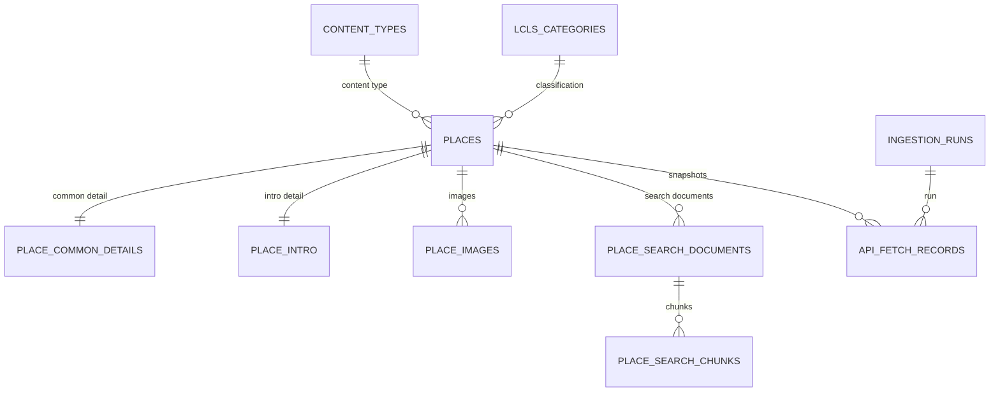

# Data Schema

## Raw CSV

`data/raw/korea_tour_openapi_jeju_places.csv`는 2,124개 장소를 한 파일에 저장합니다.

- 목록 필드: `dataset`, `contentid`, `contenttypeid`, 제목, 주소, 좌표, 분류코드
- 공통 상세: `common_*`
- 유형별 소개: `intro_*`
- 호출 상태: `*_fetch_status`, `*_fetch_error`, `*_fetched_at`

원본 주소는 `addr1`, `addr2`를 그대로 보존합니다. 카카오 역지오코딩 결과는 약관상
영구 저장하지 않으며, 지도 표시 시 좌표로 조회하는 것을 원칙으로 합니다.

## Processed JSON

`data/processed/jeju_place_rag_documents.json`의 핵심 구조는 다음과 같습니다.

```json
{
  "schema_version": "1.0",
  "preprocessing_version": "places-v5",
  "statistics": {},
  "place_groups": [],
  "documents": [
    {
      "id": "tourapi:1884191",
      "embedding_text": "...",
      "metadata": {}
    }
  ]
}
```

`embedding_text`에는 장소명, 유형, 지역, 설명과 유형별 핵심 체험·메뉴·시설을 넣습니다.
운영시간, 좌표, 주소, 추천 범위, 일정·경로 사용 여부처럼 필터링할 값은 metadata로 둡니다.

현재 전처리 결과는 2,102개 문서이며 22개는 정책 제외 또는 완전 중복으로 RAG에서
제외됩니다. 숙소 236개는 `intent_only` 문서로 포함됩니다. 원본 장소는 삭제하지
않고 MySQL에 모두 보존합니다.

`VE050200`은 원본 콘텐츠 유형과 무관하게 숙소로 정규화합니다. 명확한 복합시설 관계는
`related_contentids`, `related_relationship_types`, `related_places` metadata와 최상위
`place_relationships` 목록에 함께 저장합니다.

## ChromaDB

- 경로: `data/vectorstore/`
- 컬렉션: `jeju_places`
- 기본 모델: `text-embedding-3-small`
- 거리: cosine
- 입력 문서 수: 2,102

문서 해시·모델·차원이 같은 재실행은 임베딩 호출을 건너뜁니다. 모델이나 차원을
바꿀 때만 `--recreate`를 사용합니다.

## MySQL ERD



| 테이블 | 역할 | 현재 건수 |
| --- | --- | ---: |
| `content_types` | TourAPI 콘텐츠 유형 | 6 |
| `lcls_categories` | 사용 중인 신분류 3단계 코드 | 132 |
| `places` | 기본정보·주소·`POINT SRID 4326` | 2,124 |
| `place_common_details` | 전화·홈페이지·설명 | 2,124 |
| `place_intro` | 운영정보와 유형별 JSON | 2,124 |
| `place_images` | 대표 이미지 | 1,901 |
| `place_search_documents` | 검색 텍스트와 RAG 정책 | 2,124 |
| `place_search_chunks` | RAG 텍스트 청크 | 2,102 (재적재 후 예상) |
| `ingestion_runs` | 적재 실행 이력 | 실행당 1 |
| `api_fetch_records` | endpoint별 원본 JSON | 실행당 4,248 |

실제 임베딩 벡터는 ChromaDB에만 저장합니다.
새 전처리 결과를 MySQL에 반영하면 검색 청크는 2,102건이 됩니다.
